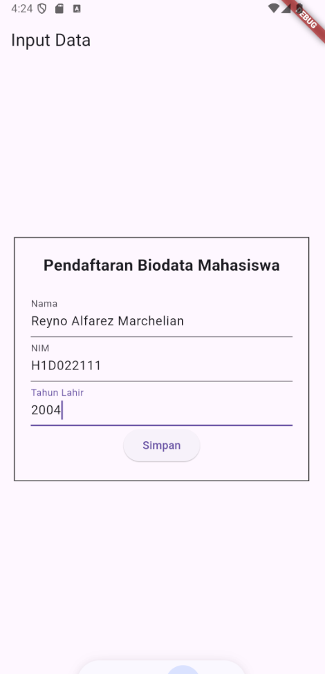

# Tugas Pertemuan 2

Nama : Reyno Alfarez Marchelian

NIM : H1D022111

Shift Baru: B

## Penjelasan



Data-data yang diinput di dalam kolom form akan disimpan oleh kelas TextEditingController dan disimpan sesuai variabel-variabel yang dibuat ketika user menekan tombol 'Simpan'
(Kolom Nama di variabel 'nama', NIM di variabel 'nim', dan Tahun di variabel 'tahun'). Kemudian user akan dibawa ke halaman kedua untuk menampilkan data yang sudah dimasukkan.


Data-data yang dimasukkan ke variabel masing-masing akan dimunculkan di halaman ini, namun terdapat variabel baru yaitu 'umur' yang berfungsi untuk menampilkan usia user
berdasarkan tahun lahir yang dimasukkan user dengan cara mengurangi tahun sekarang dengan variabel 'tahun' pada baris kode berikut:

```
final int umur = DateTime.now().year - tahun;
```
